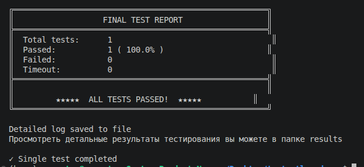

### 1. Цель и вывод по работе

**Цель:**  
Протестировать блок кода на языке описания аппаратуры SystemVerilog (data_comparator) согласно методологии UVM. Написать достаточное количество тестов для верификации функциональности.

**Вывод:**  
По результатам тестирования блока кода могу сделать вывод о том, что код **не подходит для синтеза и проектирования на интегральную схему**. Большинство ошибок связано с недействительным значением `valid_o` (подробную информацию можно посмотреть в log-файлах, сгенерированных в папке `results/`).

**Реализовано:**
- Одиночный тест (режим 1)
- Тест, обеспечивающий полное покрытие всех 262144 состояний 

**Не реализовано:**
- Coverage блок (не удалось настроить генерацию HTML-отчёта через lcov/genhtml)
- Вывод `inp1_i` и `inp2_i` в hex-формате (только двоичное представление)

---

### 2. Замечания и обоснования

#### 2.1. Упрощение входных данных

Как можно увидеть из кода, данными для входного теста являются **3 переменные**, а не 4.

Я решил, что сами значения `inp1_i` и `inp2_i` по отдельности не несут информативной нагрузки, так как в RTL-коде используется только результат операции `(inp1_i == inp2_i)`. Нас интересует исключительно их соотношение.

**Поэтому я упростил подход:**  
В тестовом окружении используется сигнал `signal_i1_i2_is_equal`, который принимает:
- `1` — если входные сигналы равны
- `0` — если входные сигналы не равны

В коде генератора (`generatorDCInTx`) значения `inp1_i` и `inp2_i` генерируются случайным образом в зависимости от требуемого соотношения:
- Если `equal = 1` → `inp1_i = inp2_i` (случайное 10-битное число)
- Если `equal = 0` → `inp1_i` и `inp2_i` — два независимых случайных 10-битных числа

**Важно:** Это упрощение корректно, если операция сравнения `(inp1_i == inp2_i)` работает без ошибок. В противном случае покрытие потребовало бы значительно больше усилий, но в целом оно реализуемо.

#### 2.2. Таблица истинности записи в регистр

В ходе решения подразумевалось, что запись в сдвиговый регистр происходит согласно таблице истинности:

| rstn | valid_i | Запись в регистр |
|:----:|:-------:|:----------------:|
| 0    | 0       | 0                |
| 0    | 1       | 0                |
| 1    | 0       | 0                |
| 1    | 1       | 1                |

#### 2.3. Полное множество состояний

Всего на вход DUT может поступать **8 состояний** (3 переменные: `rstn`, `valid_i`, `i1_i2_equal`):

| № | rstn | valid_i | i1_i2_equal |
|:-:|:----:|:-------:|:-----------:|
| 1 | 0    | 0       | 0           |
| 2 | 0    | 0       | 1           |
| 3 | 0    | 1       | 0           |
| 4 | 0    | 1       | 1           |
| 5 | 1    | 0       | 0           |
| 6 | 1    | 0       | 1           |
| 7 | 1    | 1       | 0           |
| 8 | 1    | 1       | 1           |

#### 2.4. Математическое обоснование количества тестов

Если бы наша система **не зависела от предыдущих состояний**, то 8 тестов (все комбинации входов) было бы достаточно.

Однако система хранит в себе **6 состояний** — количество триггеров в сдвиговом регистре (`res_internal[5:0]` и `valid_internal[5:0]`).

Следовательно:
- Каждое из 6 положений сдвигового регистра может находиться в одном из 8 состояний
- Общее количество внутренних состояний системы: **8⁶ = 262144**
Для обеспечения полного покрытия необходимо подать последовательность из 6 тестов (чтобы заполнить сдвиговый регистр) для каждого из 262144 состояний.


Генерация всех тестовых последовательностей реализована в папке `develop/` (файл `generate_all_sequences.cpp`). Обработка всех тестов на современном компьютере занимает **несколько секунд**.

---

### 3. Инструкция для сборки

#### 3.1. Требования

| Компонент | Минимальная версия |
|-----------|-------------------|
| Verilator | 5.049 |
| g++ | 11.0+ (C++17) |
| make | 4.0+ |

## ПРИМЕР ИСПОЛЬЗОВАНИЯ

```bash
# Полная сборка проекта
make build

# Запуск единичного теста (режим 1)
make run_test

# Запуск полной регрессии (262144 теста, режим 3)
make run_regression

make sim
make waves         
make clean

# Справка по всем командам
make help
```



